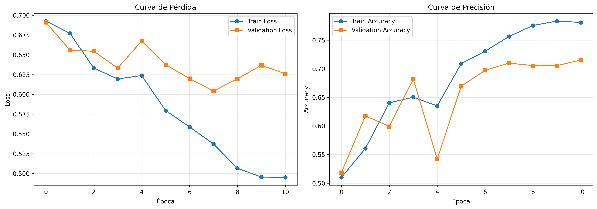

# 🎬 Análisis de Sentimientos con LSTM - IMDB Reviews

[](https://www.python.org/downloads/)
[](https://pytorch.org/)
[](LICENSE)

Proyecto final del curso de **Redes Neuronales** - Facultad de Ciencias, UNAM

**Autores:**
- Orta Castillo Maria de los Angeles - 319074253
- Solano Juárez Sebastián - 319254639

**Fecha de entrega:** 7 de diciembre del 2025

---

## 📋 Tabla de Contenidos

- [Descripción](#-descripción)
- [Resultados](#-resultados)
- [Arquitectura](#-arquitectura)
- [Instalación](#-instalación)
- [Uso](#-uso)
- [Dataset](#-dataset)
- [Entrenamiento](#-entrenamiento)
- [Requisitos del Proyecto](#-requisitos-del-proyecto)

---

## 🎯 Descripción

Este proyecto implementa un modelo de **Red Neuronal Recurrente (LSTM)** para clasificar automáticamente reseñas de películas como **positivas** o **negativas**. El modelo fue entrenado usando el dataset IMDB Movie Reviews con PyTorch.

### ¿Por qué LSTM?

Las redes LSTM (Long Short-Term Memory) son especialmente efectivas para:
- ✅ Capturar dependencias a largo plazo en secuencias de texto
- ✅ Manejar el problema del desvanecimiento del gradiente
- ✅ Procesar secuencias de longitud variable
- ✅ Balance entre rendimiento y costo computacional

---

## 📊 Resultados

El modelo alcanzó los siguientes resultados en el conjunto de prueba (25,000 reseñas):

| Métrica | Valor |
|---------|-------|
| **Accuracy** | 70.65% |
| **Precision** | 70.82% |
| **Recall** | 70.24% |
| **F1-Score** | 70.53% |
| **AUC-ROC** | 73.93% |

### Matriz de Confusión

```
                Predicción
                Neg     Pos
Real    Neg   [8,882  3,618]
        Pos   [3,720  8,780]
```

### Curvas de Aprendizaje



**Observaciones:**
- El modelo se entrenó durante 11 épocas (early stopping)
- Mejor modelo obtenido en la época 8
- Train Accuracy: 75.65% | Validation Accuracy: 71.00%

---

## 🏗️ Arquitectura

El modelo utiliza una arquitectura LSTM de dos capas con regularización:

```
Input (Secuencia de palabras)
    ↓
Embedding Layer (vocab_size: 10,000 → dim: 128)
    ↓
LSTM Layer 1 (128 → 64 unidades)
    ↓
Dropout (0.5)
    ↓
LSTM Layer 2 (64 → 32 unidades)
    ↓
Dropout (0.5)
    ↓
Fully Connected (32 → 1)
    ↓
Sigmoid Activation
    ↓
Output (Probabilidad: 0-1)
```

**Parámetros totales:** 1,342,241

### Hiperparámetros

| Hiperparámetro | Valor |
|----------------|-------|
| Vocabulario | 10,000 palabras |
| Embedding Dim | 128 |
| LSTM Hidden (capa 1) | 64 |
| LSTM Hidden (capa 2) | 32 |
| Dropout Rate | 0.5 |
| Batch Size | 64 |
| Learning Rate | 0.001 |
| Max Epochs | 15 |
| Early Stopping Patience | 3 |
| Max Sequence Length | 256 tokens |

---

## 🔧 Instalación

### Requisitos

- Python 3.8+
- PyTorch
- TensorFlow (solo para cargar dataset IMDB)
- NumPy, Pandas, Scikit-learn

### Instalación rápida

```bash
# Clonar el repositorio
git clone https://github.com/tu-usuario/lstm-sentiment-analysis.git
cd lstm-sentiment-analysis

# Instalar dependencias
pip install -r requirements.txt
```

### requirements.txt

```txt
torch>=2.0.0
numpy>=1.24.0
scikit-learn>=1.3.0
tensorflow>=2.13.0
matplotlib>=3.7.0
tqdm>=4.65.0
pandas>=2.0.0
```

---

## 🚀 Uso

### Opción 1: Inferencia con modelo pre-entrenado (Recomendado)

**No necesitas entrenar desde cero.** Descarga los pesos pre-entrenados y usa el script de inferencia.


#### 1. Ejecutar inferencia

```bash
python inference.py
```

#### 2. Salida esperada

```
=== CARGANDO MODELO PRE-ENTRENADO ===

Usando dispositivo: cpu
Cargando pesos desde: sentiment_model_weights.pth

Configuración del modelo:
  vocab_size: 10000
  embedding_dim: 128
  hidden_dim: 64
  dropout_rate: 0.5
  max_length: 256

Parámetros totales: 1,342,241

✓ Modelo cargado exitosamente

======================================================================
DEMOSTRACIÓN DE INFERENCIA
======================================================================

Reseña 1:
  Texto: This movie was absolutely fantastic! Great acting...
  Sentimiento: Positivo
  Probabilidad: 0.9234 (92.34%)
  Confianza: Alta

Reseña 2:
  Texto: Terrible waste of time. Boring and predictable...
  Sentimiento: Negativo
  Probabilidad: 0.0876 (8.76%)
  Confianza: Alta

...

¿Deseas probar el modelo con tus propias reseñas? (s/n):
```

#### 4. Modo interactivo

El script incluye un modo interactivo donde puedes escribir tus propias reseñas:

```
Reseña: This film is a masterpiece!

  → Sentimiento: Positivo
  → Probabilidad: 0.9456 (94.56%)
  → Confianza: Alta
```

### Opción 2: Uso programático

Integra el modelo en tus propios scripts:

```python
from inference import load_trained_model, predict_sentiment

# Cargar modelo
model, word_index, config = load_trained_model(
    weights_path='sentiment_model_weights.pth',
    word_index_path='word_index.pkl'
)

# Predecir sentimiento
review = "This movie was amazing and exceeded all my expectations!"
sentiment, probability, confidence = predict_sentiment(
    model, review, word_index, 
    max_length=config['max_length']
)

print(f"Sentimiento: {sentiment}")
print(f"Probabilidad: {probability:.2%}")
print(f"Confianza: {confidence}")
```

**Salida:**
```
Sentimiento: Positivo
Probabilidad: 94.32%
Confianza: Alta
```

### Opción 3: Entrenar desde cero

Si deseas entrenar el modelo desde cero:

```bash
python rn_proy_final.py
```

⏱️ **Tiempo estimado:**
- CPU: 2-3 horas
- GPU: 20-30 minutos

**Archivos generados:**
- `sentiment_model_weights.pth` - Pesos del mejor modelo
- `word_index.pkl` - Diccionario de vocabulario
- `best_model_checkpoint.pth` - Checkpoint completo
- `training_history.png` - Gráficas de entrenamiento

---

## 🗂️ Dataset

### IMDB Movie Reviews

El dataset utilizado es uno de los más populares en NLP:

- **Total:** 50,000 reseñas de películas
- **Clases:** Binarias (Positivo / Negativo)
- **División:**
  - Train: 20,000 muestras (80%)
  - Validation: 5,000 muestras (20%)
  - Test: 25,000 muestras

### Preprocesamiento

1. **Tokenización:** Cada palabra se convierte en un índice numérico
2. **Vocabulario:** Se utilizan las 10,000 palabras más frecuentes
3. **Padding:** Secuencias normalizadas a 256 tokens
   - Secuencias cortas: Se añaden ceros al final
   - Secuencias largas: Se truncan

**Ejemplo de secuencia:**
```python
Original: "This movie was great!"
Tokenizada: [12, 23, 45, 789, 2]
Padded: [12, 23, 45, 789, 2, 0, 0, 0, ..., 0]  # Hasta 256
```

**Link del dataset para descargar:**
Puedes descargar el dataset desde [IMDB Dataset of 50K Movie Reviews en Kaggle](https://www.kaggle.com/datasets/lakshmi25npathi/imdb-dataset-of-50k-movie-reviews).

---

## 🏋️ Entrenamiento

### Configuración

- **Optimizador:** Adam (lr=0.001)
- **Función de pérdida:** Binary Cross Entropy
- **Early Stopping:** Paciencia de 3 épocas
- **Regularización:** Dropout (0.5)

### Proceso

El entrenamiento se realizó en **Google Colab** con los siguientes pasos:

```python
# 1. Cargar y preprocesar datos
X_train, X_val, X_test, y_train, y_val, y_test = load_imdb_data()

# 2. Crear modelo
model = SentimentLSTM(
    vocab_size=10000,
    embedding_dim=128,
    hidden_dim=64,
    dropout_rate=0.5
)

# 3. Entrenar con early stopping
# Mejor modelo: Época 8
# Early stopping: Época 11
```

### Evolución del entrenamiento

| Época | Train Loss | Train Acc | Val Loss | Val Acc |
|-------|-----------|-----------|----------|---------|
| 1 | 0.6927 | 51.01% | 0.6910 | 51.86% |
| 4 | 0.6195 | 65.03% | 0.6332 | 68.20% |
| 8 | 0.5374 | 75.65% | 0.6041 | **71.00%** ⭐ |
| 11 | 0.4951 | 78.11% | 0.6261 | 71.54% |

 **Mejor modelo guardado en época 8**


---

##  Requisitos del Proyecto

Este proyecto cumple con todos los requisitos del curso:

### ✓ Requisitos Obligatorios

- [x] **Dataset de datos no estructurados:** Texto (reseñas IMDB)
- [x] **Capa compleja:** 2 capas LSTM (recurrentes)
- [x] **Regularización:** Dropout (50%)
- [x] **Hiperparámetros documentados:** Tabla completa con justificaciones
- [x] **Métricas de sklearn:** Accuracy, Precision, Recall, F1-Score, AUC-ROC
- [x] **Framework:** PyTorch
- [x] **Código documentado:** Comentarios y docstrings completos

### ✓ Requisitos de Entrega

- [x] **Pesos del modelo disponibles:** Para inferencia sin reentrenamiento
- [x] **Script de inferencia funcional:** `inference.py`
- [x] **Enlace de descarga:** Google Drive con archivos necesarios
- [x] **Documentación de uso:** README completo

---

## Análisis de Resultados

### Fortalezas del Modelo

✅ **Balance entre clases:** FP ≈ FN (sin sesgo)
✅ **Generalización adecuada:** No overfitting excesivo
✅ **Eficiencia:** Modelo ligero (1.3M parámetros)
✅ **Tiempo de inferencia:** < 1 segundo por reseña

### Limitaciones

⚠️ **Accuracy 70.65%:** Modelos Transformer (BERT) superan 90%
⚠️ **Sarcasmo e ironía:** Difíciles de detectar con LSTM
⚠️ **Dependencias largas:** Algunos contextos muy extensos se pierden

### Comparación con Estado del Arte

| Modelo | Accuracy | Parámetros | Tiempo Inferencia |
|--------|----------|------------|-------------------|
| **LSTM (este)** | 70.65% | 1.3M | < 1s |
| CNN-Text | ~72% | 2M | < 1s |
| BERT-base | ~93% | 110M | ~5s |
| RoBERTa | ~96% | 125M | ~6s |

**Conclusión:** El modelo LSTM ofrece un excelente balance entre rendimiento y eficiencia para aplicaciones con recursos limitados.

---

## Trabajo Futuro

Posibles mejoras y extensiones:

1. **Embeddings pre-entrenados**
   - Usar GloVe o Word2Vec
   - Transfer learning con embeddings contextuales

2. **Arquitecturas avanzadas**
   - Bi-directional LSTM
   - LSTM con mecanismos de atención
   - Comparar con Transformers (BERT, RoBERTa)

3. **Análisis de errores**
   - Estudiar casos donde el modelo falla
   - Identificar patrones lingüísticos problemáticos

4. **Optimización**
   - Grid search de hiperparámetros
   - Pruning del modelo
   - Quantización para edge devices

5. **Ensemble de modelos**
   - Combinar LSTM + CNN
   - Voting classifier con múltiples arquitecturas

---

## 📚 Referencias

- Maas, A. L., et al. (2011). *Learning word vectors for sentiment analysis*. ACL 2011.
- Hochreiter, S., & Schmidhuber, J. (1997). *Long short-term memory*. Neural Computation, 9(8), 1735-1780.
- Paszke, A., et al. (2019). *PyTorch: An imperative style, high-performance deep learning library*. NeurIPS 2019.
- Goodfellow, I., Bengio, Y., & Courville, A. (2016). *Deep Learning*. MIT Press.

---

## 📄 Licencia

Este proyecto es un trabajo académico para el curso de Redes Neuronales de la Facultad de Ciencias, UNAM.

---


<div align="center">

** Si este proyecto te fue útil, considera darle una estrella **

Hecho con ❤️ para el curso de Redes Neuronales - FC UNAM

</div>
